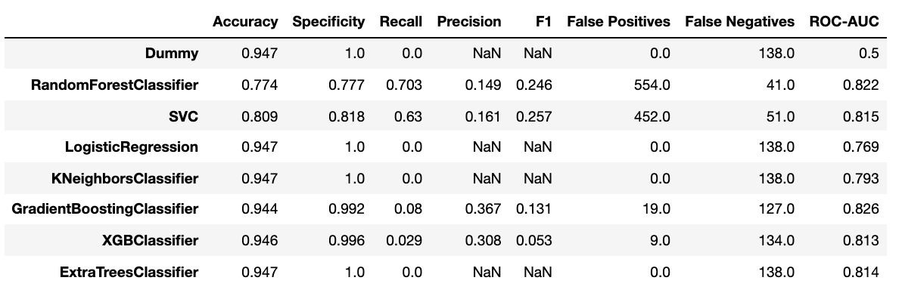
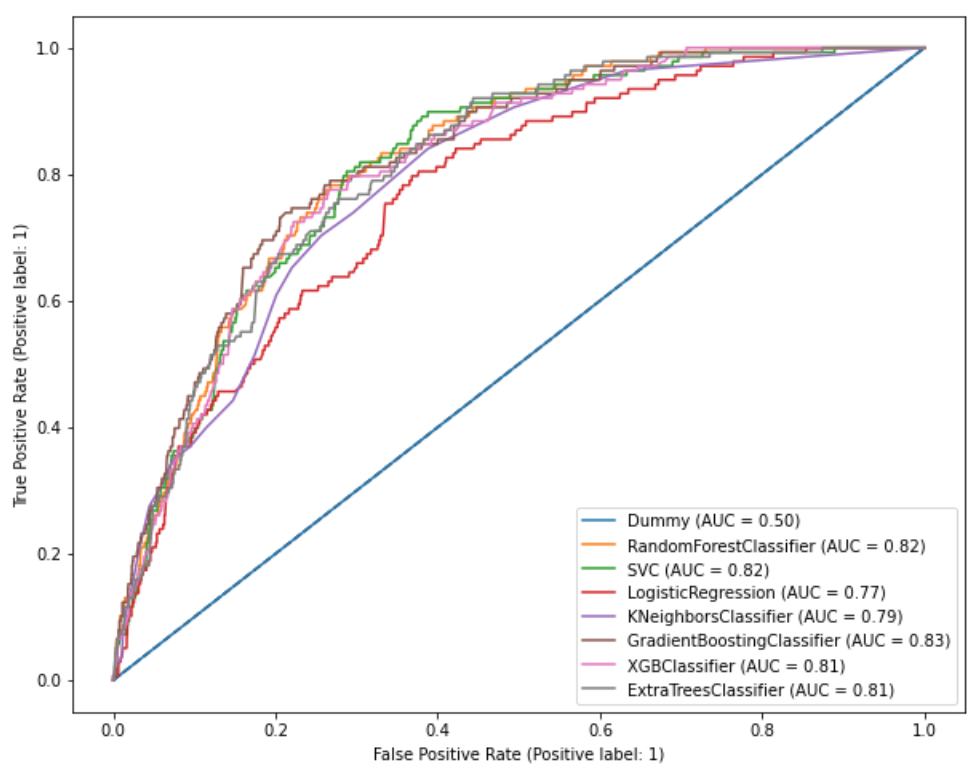
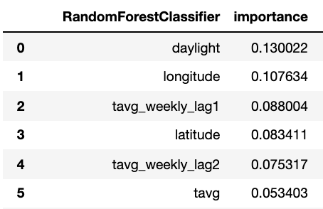

# Introduction

The West Nile virus (WNV) is the leading cause of mosquito-borne disease in the continental United States.  It is most commonly spread to people by the bite of an infected mosquito. Cases of WNV occur during mosquito season, which starts in the summer and continues through fall. There are no vaccines to prevent or medications to treat WNV in people. About 1 in 5 people who are infected develop a fever and other symptoms. About 1 out of 150 infected people develop a serious, sometimes fatal, illness.

In 2002, the first human cases of West Nile virus were reported in Chicago. By 2004 the City of Chicago and the Chicago Department of Public Health (CDPH) had established a comprehensive surveillance and control program that is still in effect today. In view of this outbreak, the Chicago Department of Public Health (CDPH) has set up a surveillance and control system to trap mosquitos and test for the presence of WNV. The goal of this project is to use these surveillance data to predict the occurrence of WNV given time, location, and mosquito species.

## Problem Statement

Our project is aimed at predicting when and where different species of mosquitos will test positive for West Nile virus. This will help the City of Chicago and Chicago Department of Public Health (CDPH) more effectively allocate resources towards preventing transmission of this potentially deadly virus. Specifically, our model will use a combination of weather, time and location features to predict the presence of WNV within mosquito traps set up throughout Chicago. The model with the highest ROC-AUC will be submitted to Kaggle, while the model with the lowest false negatives and best sensitivity score will be used as the production model - failure to accurately detect WNV-positive mosquitos would be deleterious to public health.

Our project also aims to determine the best strategy for controlling the spread of the West Nile Virus, as well as analyzing the various trade-offs that need to be made in implementing our model.

# Data Cleaning

- Imputing null values for the weather dataset
- Formatting erroneous sunset values
- Deleting duplicates in spray dataset

# EDA

### Mosquito species

Preliminary research from NCBI has suggested that the ability of different mosquito species to acquire and transmit West Nile Virus (WNV) is highly variable. Culex mosquitoes are the dominant global transmission vector of WNV to humans; but their transmission rates among various species of the Culex genus may vary widely. As a result, it will be worth investigating which Culex mosquito species is the most dominant vector.

This factor is even more critical than metereological features in predicting WNV transmission.

### Metereological Features

#### Engineering Temperature Fluctuation

Most laboratory mosquito research appears to elucidate the relationship between a static temperature and mosquito vector growth rate/ WNV transmission rates. However, in reality, temperature is not perfectly controlled, and instead follows a stochastic pattern. There is insufficient data displaying the effect of a fluctuating or dynamic temperature system on WNV replication and transmission rates.

Instead, research regarding a closely related virus in the flavivirus family, Zika, found that as temperature fluctuations increases, it decreases the ability of mosquitos to transmit the virus. As a result, a variable measuring the fluctuation of temperature would be engineered. As climate change intensifies, the importance of this variable will heighten.

This feature is engineered by taking the differences between tmax & tmin.

#### Engineering Daylight Hours

Research on NCBI shows that light intensity is also a critical factor to look at. The steps below show data preparation before engineering of the \\\"daylight\\\" variable as an approximation to light intensity, operationalized by sunset - sunrise. Although this variable shows colinearity with average temperature, laboratory mosquito research has successfully isolated the two, and proven that light intensity alone (independent of temperature increase) would increase important biological steps in the WNV transmission process.

This feature is engineered by taking the differences in sunset & sunrise.

#### Engineering Relative Humidity

It is common knowledge that humidity stimulates mosquito growth and transmission of diseases like Dengue and Malaria. A similar pattern is expected to be found for WNV.

#### Analysis of Meterological Features

Analysis of the meterological features of Chciago show that temperature peaks around week 30 at almost 80 degrees Farenheit. Daylight hours peak at week 25 at greater than 15 hours.

Relative humidity showed a very mild upward trend across the weeks, with an extremely high volatility. Temperature fluctuation also showed a very high level of volatility.

Weeks 30-38 stood out as weeks with the highest level of precipitation (rainfall).

#### Lead & Lag Indicators for WNV

Analysis from this section showed that precipitation & temperature are leading indicators, while WNV occurrences are extremely responsive to changes in relative humidity from week 31-37.

##### Humidity

Relative humidity dropped at 27.5 before increasing again, peaking at week 34. WNV occurrences only showed a direct relationship with relative humidity between week 31-37. This suggests that WNV occurrences are extremely responsive to relative humidity from week 31-37 -a change in relative humidity almost immediately results in a change of WNV transmission.

##### Precipitation

Precipitation levels may be a leading indicator because the peak in precipitation (week 27.5) occurred 2.5 weeks before the gradual increase in WNV occurrences from week 27.5-35.0.

However, there was a spike in precipitation at week 25.0 but there may be other confounding factors such as temperature that do not generate an increase in WNV occurrences.

##### Temperature

Average temperature also appears to be a leading indicator for WNV occurrences - the gradual increase in temperature occurred 8 weeks prior to the increase in WNV occurrences. This data suggests that average temperature and precipitation interact to generate an increase in WNV occurrences.

Note that the synergy between humidity, temperature & precipitation factors are important - temperature increase alone or precipitation increase alone DO NOT generate an increase in WNV occurrences.

Average monthly temperature for the month of May (i.e. month in which week 20 & 21 falls under) from 2007-2014.

##### Average monthly precipitation

Average monthly precipitaion for the month of May (i.e. month in which week 20 & 21 falls under) from 2007-2014.

### Correlation Matrix

Correlations between features and wnv present were generally low (less than 0.2). Nummosquitoes was the most strongly correlated feature with WNV present but they are not present in the train dataset and will be dropped.

# Model Selection

8 different models are tested & evaluated and the metric used for Kaggle scoring is ROC-AUC. In contrast, metric used for model selection would be sensitivity because it is particularly momentous when investigating a biomedical problem - we want to minimize the amount of false negatives (WNV-positive mosquitoes predicted as WNV negative) generated by our model because false negatives are deleterious to public health.

Even though ROC-AUC is the metric for Kaggle datasets, we will consider false negative rates and try to avoid overfitting when selecting our model for production. The best model is the Random Forest Classifier, with one of the lowest false negative rates (41) and a good ROC-AUC score (0.822) that is only marginally lower than the Gradient Boosting Classifier (0.826 without oversampling and 0.827 with oversampling).

From the graph, it can be observed that most of the models perform similarly in terms of ROC-AUC. As there is a large class imbalance in our training data, ROC curve might present a overly optimistic view of the model's performance. Precision-Recall curve plot could be a better indicator on model's performance. From the Precision Recall AUC score, Gradient Boosting Classifier (0.21) and Random Forest Classifier (0.20) have the 2 highest scores. Both models performance is far from perfect score of 1 but performed better compared to the baseline score of 0.05.

### Feature Importances

The final production model, Random Forest Classifier, predicted that these are the most important features;
- Daylight
- Longitude & Latitude
- Average and Lagged temperature

# Cost Benefit Analysis

## Annual Cost Projection 

### Pesticides used - Adulticides & Larvicides 

A few factors to consider in this analysis include the type of pesticides used (larvicides vs adulticides), volume of spray needed, and frequency of spraying.

While this website details the costs of larvicides vs adulticides for North Dakota, [1](http://www.gfmosquito.com/wp-content/uploads/2013/06/2013-North-Dakota-Bid-Tabulation.pdf) we expect the price ranges to be similar for Chicago.

In general, larvicides are 3-22x more expensive than adulticides, with Altosid Liquid Larvicide Concentrate SR-20 2X2.5 being the most expensive ($4470/gallon).

Data about the efficacy of adulticides vs larvicides were unable to be found. If minimizing cost is the priority of CDC, adulticides ($170-220/gallon) are preferred. If minimizing transmission is the priority, a combined approach of adulticides & larvicides gives the best value for money.

Among the 2 most abundant species, Culex restuans  is more likely to transmit WNV, although Culex Pipiens is more likely to get infected[2](https://www.ncbi.nlm.nih.gov/pmc/articles/PMC2929059/). The government should prioritize spraying neighborhoods with a higher incidence of Culex restuans, followed by Culex Pipiens. If possible, drone technology can be used to spray mosquitoes, because they complete the same task for a fraction of the price of a helicopter.[3](https://energycentral.com/c/pip/drone-vs-helicopters-%E2%80%93-utility-inspections).

CDC has also shown that Culex mosquitoes have a life cycle of approximately 7-10 days (from larvae to adulthood)[4](https://www.cdc.gov/westnile/resources/pdfs/FS_MosquitoLifeCycle-508.pdf). There is also a two weeks lag between mosquito growth and virus transmission (EDA). As a result, the spraying cycle can be aligned with the mosquito growth cycle in order to maximize results - consult the relevant experts for more details on how to implement this strategy.

### Species, Life Cycle, and Drone usage

Among the 2 most abundant species, Culex restuans  is more likely to transmit WNV, although Culex Pipiens is more likely to get infected[2](https://www.ncbi.nlm.nih.gov/pmc/articles/PMC2929059/). The government should prioritize spraying neighborhoods with a higher incidence of Culex restuans, followed by Culex Pipiens. If possible, drone technology can be used to spray mosquitoes, because they complete the same task for 10-15% of the price of a helicopter.[3](https://energycentral.com/c/pip/drone-vs-helicopters-%E2%80%93-utility-inspections).

CDC has also shown that Culex mosquitoes have a life cycle of approximately 7-10 days (from larvae to adulthood)[4](https://www.cdc.gov/westnile/resources/pdfs/FS_MosquitoLifeCycle-508.pdf). There is also a two weeks lag between mosquito growth and virus transmission (EDA). As a result, the spraying cycle can be aligned with the mosquito growth cycle in order to maximize results - consult the relevant experts for more details on how to implement this strategy.

### Weather Features & Climate Change

Monte Carlo simulation or other simulation strategies can be used to model the effect of climate change on Culex mosquito growth and WNV transmission. Moving forward, summer temperatures are expected to increase because of global warming, and more extreme weather conditions are expected (eg. extreme changes between daily precipitation rate). According to NCBI, these meterological factors are more favourable for mosquito growth rate [5]("https://www.ncbi.nlm.nih.gov/pmc/articles/PMC4342965/"). CDC should take these factors into account when crafting a strategy in order to best tackle this virus, and account for the cost increase per year in controlling mosquito populations in their budget.

## Benefits

As of 2014, the WNV virus has cost America almost $800 million in terms of healthcare and economic costs; this value is expected to be sharply higher by now (2022).[6](https://www.sciencedaily.com/releases/2014/02/140210184713.html)

Hospital cost per patient with the following complications from WNV:
1. Acute flaccid paralysis: (median USD 25,117; range USD 5,385– USD283,381)
2. Encephalitis (median USD20,105; range USD3,965–USD324,167).
3. Meningitis (median USD10,556; range USD0–USD260,748). [7](https://www.ncbi.nlm.nih.gov/pmc/articles/PMC3945683/)

### Neighborhood Location

According to our EDA analysis, it has been discovered that more spraying has been conducted in wealthier neighborhoods as opposed to less privileged neighborhoods. Because less privileged individuals are less able to afford the exorbitant costs of insurance and American healthcare, it would be more prudent to spray these neighborhoods.

Neighborhood age should also be taken into account because older individuals (ages 60-89) have a thinner blood brain barrier and are more likely to get more severe neurological effects from the West Nile Virus[4](https://www.ncbi.nlm.nih.gov/pmc/articles/PMC3320478/).

### Working with Experts in a Multi-Disciplinary Team

In addition to biostatisticians and epidemologists, these data can be presented to scientists specializing in mosquito biology and infectious diseases, as these scientists will have a greater mastery of this subject matter and more expertise in feature selection and feature engineering. For example, they can utilize their in-depth expertise of mosquito lifecycle, habitats and breeding habits to generate a model with an edge in predicting WNV transmission.

Further collaborations with medical doctors, particularly infectious diseases specialists and internists, can also help them more rapidly identify and treat WNV cases before the individual progresses to a more severe stage of the disease, especially in neighborhoods with a high infection rate. This will definitely increase the odds of patient recovery and decrease their medical bills.

# Conclusions

CDC should prioritize spraying areas with a high incidence of Culex Pipiens and account for factors such as climate change, species life cycle, and drone usage when crafting public health policies. In addition, I would recommend spraying less privileged neighborhoods and working with experts in a multi-disciplinary team (eg. mosquito biologists, infectious diseases specialists) to best tackle this epidemic.